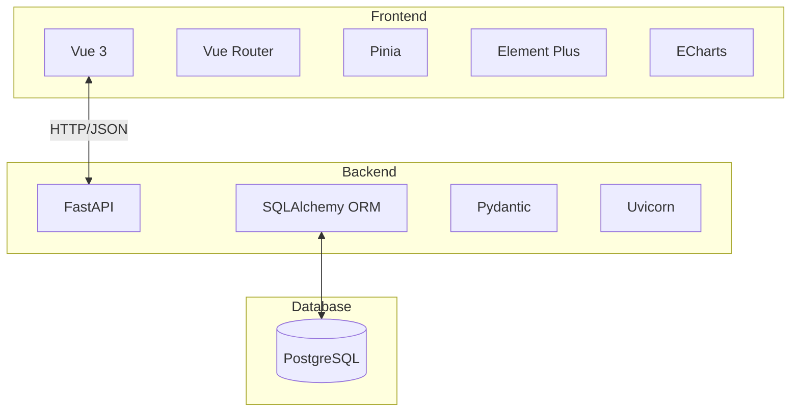
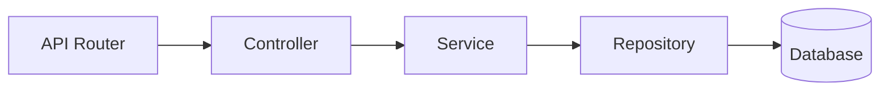
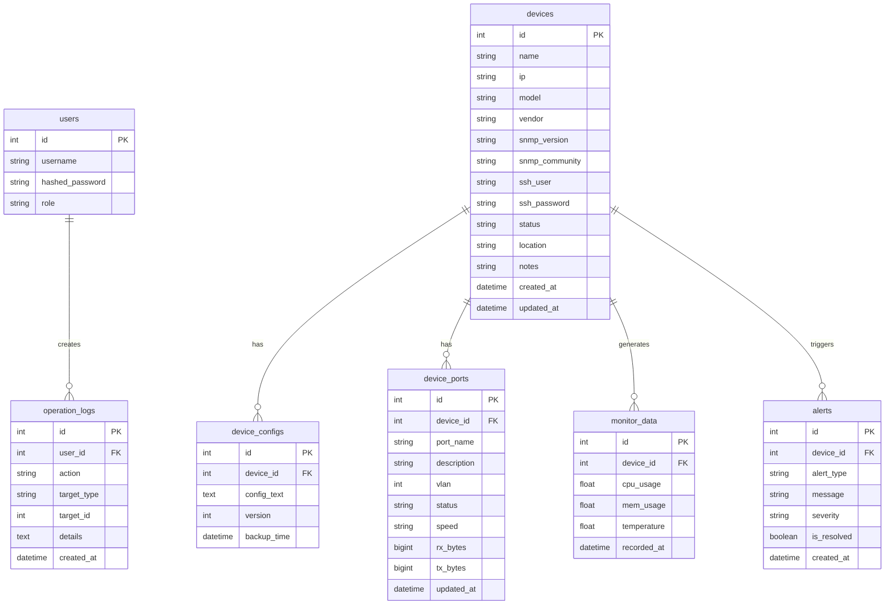

## 1. Architecture Design
NetManager 采用前后端分离架构，前端使用 Vue 3 构建 SPA，后端使用 FastAPI 提供 RESTful API，数据库使用 PostgreSQL 存储数据。



## 2. Technology Description
- 前端：Vue 3.4 + Composition API + Vue Router 4 + Pinia + Element Plus + ECharts + Vite 5
- 后端：Python 3.11 + FastAPI 0.109 + SQLAlchemy 2.0 + Pydantic 2 + Uvicorn
- 数据库：PostgreSQL 15
- 部署：Docker + Docker Compose

## 3. Route Definitions
| Route | Purpose |
|-------|---------|
| /login | 登录页面 |
| /dashboard | 仪表板 |
| /devices | 设备列表 |
| /devices/:id | 设备详情 |
| /alerts | 告警中心 |
| /logs | 操作日志 |

## 4. API Definitions

### 4.1 Auth
```typescript
// POST /api/login
interface LoginRequest {
  username: string;
  password: string;
}

interface LoginResponse {
  access_token: string;
  token_type: string;
  user: {
    id: number;
    username: string;
    role: string;
  };
}
```

### 4.2 Devices
```typescript
interface Device {
  id: number;
  name: string;
  ip: string;
  model: string;
  vendor: string;
  snmp_version: string;
  snmp_community: string;
  ssh_user: string;
  ssh_password: string;
  status: 'online' | 'offline' | 'maintenance';
  location: string;
  notes: string;
  created_at: string;
  updated_at: string;
}

// GET /api/devices
// POST /api/devices
// PUT /api/devices/:id
// DELETE /api/devices/:id
```

### 4.3 Dashboard
```typescript
interface DashboardStats {
  total_devices: number;
  online_devices: number;
  offline_devices: number;
  active_alerts: number;
}

// GET /api/dashboard/stats
```

## 5. Server Architecture Diagram


## 6. Data Model

### 6.1 Data Model Definition


### 6.2 Data Definition Language
```sql
-- Users Table
CREATE TABLE users (
    id SERIAL PRIMARY KEY,
    username VARCHAR(50) UNIQUE NOT NULL,
    hashed_password VARCHAR(255) NOT NULL,
    role VARCHAR(20) NOT NULL DEFAULT 'viewer'
);

-- Devices Table
CREATE TABLE devices (
    id SERIAL PRIMARY KEY,
    name VARCHAR(100) NOT NULL,
    ip VARCHAR(45) NOT NULL,
    model VARCHAR(100),
    vendor VARCHAR(50),
    snmp_version VARCHAR(10),
    snmp_community VARCHAR(100),
    ssh_user VARCHAR(50),
    ssh_password VARCHAR(255),
    status VARCHAR(20) DEFAULT 'offline',
    location VARCHAR(255),
    notes TEXT,
    created_at TIMESTAMP DEFAULT CURRENT_TIMESTAMP,
    updated_at TIMESTAMP DEFAULT CURRENT_TIMESTAMP
);

-- Initial data
INSERT INTO users (username, hashed_password, role) VALUES
('admin', '$2b$12$LQv3c1yqBWVHxkd0LHAkCOYz6TtxMQJqhN8/LewY5GyW5W5W5W5W', 'admin'),
('viewer', '$2b$12$LQv3c1yqBWVHxkd0LHAkCOYz6TtxMQJqhN8/LewY5GyW5W5W5W5W', 'viewer');
```
