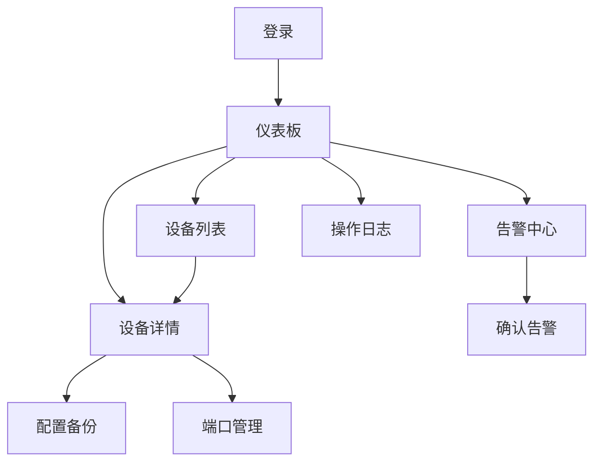

## 1. Product Overview
NetManager 是一个专业的网络设备管理系统，帮助网络管理员高效监控、配置和维护网络设备。
- 解决网络设备分散管理、配置备份困难、状态监控滞后的问题
- 提供一站式设备管理、配置备份、状态监控和告警功能，提高网络运维效率

## 2. Core Features

### 2.1 User Roles
| Role | Registration Method | Core Permissions |
|------|---------------------|------------------|
| 管理员 | 系统预置 | 完整设备管理、配置操作、权限管理 |
| 观察员 | 系统预置 | 只读访问，查看设备状态、配置和告警 |

### 2.2 Feature Module
1. **登录页**: 用户身份认证
2. **仪表板**: 设备统计、状态概览、告警卡片
3. **设备列表**: 设备 CRUD、搜索筛选、导入导出
4. **设备详情**: 配置历史、端口管理、实时监控
5. **告警中心**: 告警列表、确认清除
6. **操作日志**: 操作记录查询

### 2.3 Page Details
| Page Name | Module Name | Feature description |
|-----------|-------------|---------------------|
| 登录页 | 登录表单 | 用户名密码登录，JWT token认证 |
| 仪表板 | 统计卡片 | 设备总数、在线/离线数量、告警数量 |
| 设备列表 | 设备表格 | 分页展示、搜索、筛选、批量操作 |
| 设备详情 | 配置备份 | 备份列表、版本对比、配置恢复 |
| 设备详情 | 端口管理 | 端口列表、状态切换、流量图表 |
| 告警中心 | 告警列表 | 告警展示、确认、筛选 |
| 操作日志 | 日志表格 | 操作记录查询 |

## 3. Core Process
用户登录后进入仪表板查看网络状态概览。可进入设备列表管理设备信息，或在设备详情页进行配置备份和端口管理。系统自动监控设备状态并产生告警，用户在告警中心处理告警。所有操作均记录在日志中。

## 4. User Interface Design
### 4.1 Design Style
- 主色调：深蓝 #1e3a8a，辅助色：青色 #0891b2
- 按钮风格：圆角矩形，带轻微阴影，悬停动画
- 字体：Inter 系统字体，标题粗体
- 布局风格：侧边栏导航 + 内容区卡片布局
- 图标风格：简洁线性图标

### 4.2 Page Design Overview
| Page Name | Module Name | UI Elements |
|-----------|-------------|-------------|
| 登录页 | 登录表单 | 居中卡片，渐变背景，简洁输入框 |
| 仪表板 | 统计卡片 | 彩色渐变卡片，数字动画 |
| 设备列表 | 设备表格 | 条纹行，状态标签，操作按钮 |
| 设备详情 | 配置列表 | 时间轴布局，diff 对比 |
| 设备详情 | 端口图表 | ECharts 折线图，双轴显示 |
| 告警中心 | 告警列表 | 严重程度颜色标识 |

### 4.3 Responsiveness
- 桌面端优先，平板和移动端自适应
- 侧边栏在移动端可折叠
- 表格在小屏幕转为卡片形式展示

### 4.4 Theme Support
- 支持亮色/暗色主题切换
- 使用 CSS 变量统一管理主题色
